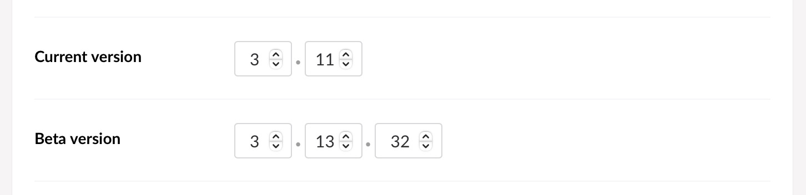
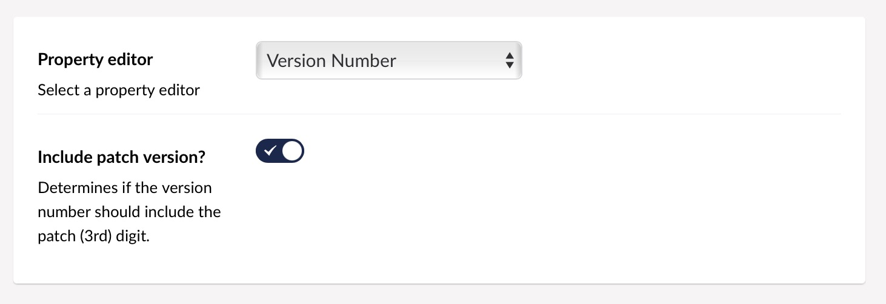

# Version Number for Umbraco

This property editor for Umbraco v7 & v8 shows two or three "number" inputs
combined to display a typical version number with major, minor and patch
digits/parts.

The configuration allows for displaying only the major and minor
or all three, depending on how granular the version your particular document
type should display.

The [releases page][RELS] has PropertyValueConverters for use in your projects.

[RELS]: https://github.com/vokseverk/Vokseverk.VersionNumber/releases

## Screenshots

### Editor



### Configuration



## Rendering

The raw value is a JSON object with the individual segments, e.g.:

```json
{
  "major": 7,
  "minor": 15,
  "patch": 5
}
```

Using the PropertyValueConverter you can get either the full version number or
any of its parts, like this:

```razor
<dl>
	<dt>Full version</dt>
	<dd>@(Model.VersionNumber)</dd>
	<dt>Major</dt>
	<dd>@Model.VersionNumber.Major</dd>
	<dt>Minor</dt>
	<dd>@Model.VersionNumber.Minor</dd>
	<dt>Patch</dt>
	<dd>@Model.VersionNumber.Patch</dd>
</dl>
```

(If the editor is configured to not use the *Patch* version, the `.Patch`
property is returned as `-1` and the full version only has the major and minor
parts.)

## Developing & Building

On macOS you can run the `build.sh` script from the terminal, which will
build a ZIP file in the `dist` folder that is installable from
Umbraco 8's _Packages_ section or Umbraco 7's _Developer > Packages_ section.

The build script versions the files so it's easier to test the package inside
an Umbraco installation by uninstalling the existing version and then
installing a new build. Existing data-types keep their data as long as their
alias and/or storage type isn't changed.

To update the version number, increment the `packageVersion` entity in the
`src/package.ent` file.

