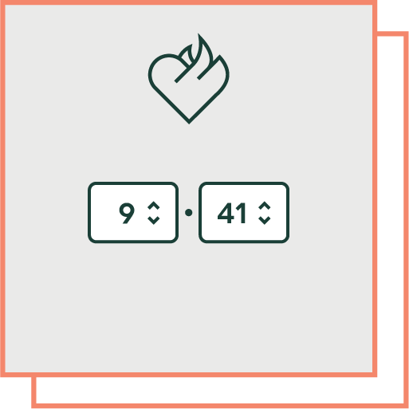

# Version Number for Umbraco



This property editor for Umbraco v10 shows two or three "number" inputs
combined to display a typical version number with major, minor and revision
digits/parts.

The configuration allows for displaying only the major and minor
or all three, depending on how granular the version your particular document
type should display.

The included `PropertyValueConverter` makes sure to return the value as a `System.Version`.


## Screenshots

### Editor


### Configuration


## Rendering

The raw value is a JSON object with the individual segments, e.g.:

```json
{
  "major": 7,
  "minor": 15,
  "revision": 5
}
```

Using the `PropertyValueConverter` you get either the full version number or
any of its parts, like this:

```razor
<dl>
	<dt>Full version</dt>
	<dd>@(Model.VersionNumber)</dd>
	<dt>Major</dt>
	<dd>@Model.VersionNumber.Major</dd>
	<dt>Minor</dt>
	<dd>@Model.VersionNumber.Minor</dd>
	<dt>Revision</dt>
	<dd>@Model.VersionNumber.Build</dd>
</dl>
```

(If the editor is configured to not use the *Revision* number, the `.Build`
property is returned as `-1` and the full version only has the major and minor
parts.)

## Developing & Building

On macOS you can run the `nuget-build.sh` script from the terminal, which will
build a .nupkg file in the `dist` folder.

